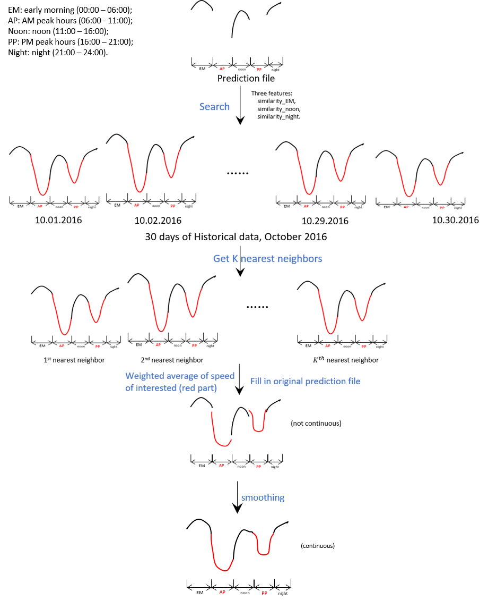

# A KNN-Based Solution to TRANSFOR19 Competition

## Backgrounds of TRANSPOR19
Organized by: ABJ70 Artificial Intelligence and Advanced Computing Applications

Supported by: IEEE ITSS Technical Activities Sub-Committee “Smart Cities and Smart Mobility”

Sponsored by: Didi Chuxing

#### Resources:
- the official github repository of this competition: 
	[github page](https://github.com/TRANSFORABJ70/TRANSFOR19)
- The GPS trace data of Didi drivers:
	[GAIA Open Dataset](https://outreach.didichuxing.com/research/opendata/en/)

## description of our solution
### Problem formulation
First, we formulate this problem as univariate time series prediction. But the task is not like traditional 
univariate time series task because we are not given the date of the prediction target and the information 
(observation data points) of both before and after prediction are provided, for example, the speed of early 
morning (0:00 am - 5:55am) and noon (11:00am - 3:55pm). 
### High-level discription
It is reasonable to think of a potential solution that consider the features of time series in prediction file 
and use these features to find similar ones that belong to historical data. The instances (neighbors) with 
similar features are then used to infer the speed of interested time period in the prediction file. This 
general idea serves as the foundation of our solution. Since it is much like K-Nearest Neighbors (KNN) model, 
we name our solution KNN-based.
### intuitive view of our proposal

### Pipeline overview
1. extract historical speed of target road from given raw GPS files.
2. missing value imputation.
3. handle outliers.
4. training and validation datasets preparation.
5. KNN implementation.
6. smoothing the output of model.
### Searching for hyperparameters
hyperparameters considered:
- the degree of polynomial curve to fit the historical speed in order to cut off variance (noise).
- the definition of similarity. 
- the number of K (neighbors)
- the weights for K to average speed
- the degree of polynomial curve to smooth final results.
- the weights of data points when smoothing the final results. For example, it makes sense if more weights are assigned to the points near our prediction time period (like 5:55, 11:05 etc.).
### Some visualizations
1. final smoothing (northbound)

2. predictions (southbound)

## Reflections
The proposed model is easy to deploy and could achieve decent prediction results as our validation results suggest. The main advantages of our model are:

1. Not like traditional time series prediction models only consider the information beforehand, our model could utilize the information after the time period of predictions, which renders more accurate results. 
2. the proposed model is capable of predicting speed on days with accidental events, e.g., holidays, soccer games. Because some history days are likely to have similar events and could be used to make predictions.
3. Also, no mathematical formula is needed to make predictions because of the nonparametric nature of KNN. The trend of speed is stored implicitly inside the history. 
4. The smoothing at the preprocessing stage is proved to be effective in decreasing noise/errors. And the extra steps of smoothing both before and after actual modelling improves the performance substantially.

The limitation is that it would be error-prone if the historical data is insufficient since there are few samples for model to search for. In our case, 30 days of data is somewhere in the middle. In real practice, Model would definitely behavior better if more and more historical data is incorporated.

## Instructions
This repository is intended to show results of our solution and how we get there. If you want to run our
code, your need to download original datasets from GAIA website (they are too big to be stored here). And 
some necessary changes of source code is required, e.g., the path to load data.

## Important files:
1. to extract speed information from GPS raw data:
	- 'target_road_file_maker.ipynb'
	- 'historical_speed_extracter.ipynb'
2. preprocessing:
	- 'clean prediction file.ipynb'
	- 'Splitting training and validation sets.ipynb'
	- 'visualization & transforming of extracted speed data.ipynb'
3. modelling:
	- 'KNN-based solution.ipynb'
4. visualization:
	- 'look into the GPS data.ipynb' 
	- 'visualization of target road segment.ipynb'
	- 'visualization & transforming of extracted speed data.ipynb'
	- 'KNN-based solution.ipynb' 
5. prediction results:
	- 'Predictions_north.csv'
	- 'Predictions_south.csv'
6. short report of our proposal
	- 'knn-based solution.docx'

## Contact:
**Team RiverHawks** 

- Team leader: 
	
	- Liming Jiang, University of Massachusetts Lowell (Liming_Jiang@student.uml.edu)

- Team members: 
	- Yuanchang Xie, University of Massachusetts Lowell (Yuanchang_Xie@uml.edu)
	- Tingjian Ge, University of Massachusetts Lowell  (ge@cs.uml.edu)
	- Yunpeng Wu, Baidu Inc (wuyunpengbilly@gmail.com)
	- Yan Li, University of Massachusetts Lowell  (Yan_Li1@student.uml.edu)

